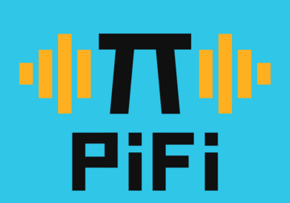

**Nerves firmware that turns a Raspberry Pi into a hi-fi component.**

[pifi.harton.dev](https://pifi.harton.dev)

---

PiFi plugs into your stereo and behaves like any other box on the shelf. It has
buttons, a screen, and a volume control, and you can use it without reaching for
a phone or a laptop.

It pulls audio off the network and feeds it to a USB DAC, or to a DAC sitting on
the board's pins. There's a Phoenix LiveView web interface for setup and for
control when you do want a screen in your hand, and the device draws its own
screen for when you don't.

## What works today

Internet radio, podcasts, and your own library from Plex or Jellyfin. The web
interface browses, searches, holds a play queue, saves playlists, and drives
playback.

Two screens are supported: the Adafruit PiTFT 2.8" and the Pimoroni Pirate Audio
240x240. The buttons on both work.

Podcast episodes and any album you favourite are downloaded to the card, so they
play with the network down and pick up exactly where you left off. Skipping
within a track is instant — it moves the reader rather than restarting the
pipeline — and it works for MP3, AAC and FLAC.

## How it's built

| | |
|---|---|
| Board | Raspberry Pi Zero 2 W, on a custom Nerves system (`pifi_rpi0_2`) |
| Audio out | USB DAC, or a DAC on the board's pins, via `aplay` |
| Pipeline | Membrane, with precompiled libmad and fdk-aac decoders |
| Streaming | Shoutcast and HLS |
| Extra binaries | [NBPR](https://github.com/jimsynz/nbpr), for the Ogg Vorbis and FLAC decoders |
| Data | Ash on SQLite, on the writable partition at `/root` |
| Background work | Oban |
| Web | Phoenix LiveView |
| Device screen | Emerge, behind a `PiFi.Peripheral` behaviour |

Sources, outputs and peripherals are all behaviours. A peripheral owns exactly
one piece of hardware: it receives typed events about the player and where you
are in the menus, it owns its own layout, fonts and scrolling, and it publishes
what you pressed. A screen and a touch panel share that one behaviour.

The point of that is you can add a music service, a different DAC, an SSD1306
OLED, or a new control without touching the player or the interface.

**The code is the specification.** There's no `docs/` directory, because prose
kept separately goes stale and then lies. Every module explains what it does and
why in its own moduledoc, and `PiFi.Source`, `PiFi.Output` and `PiFi.Peripheral`
spell out the contract a new source, output or piece of hardware has to meet.

## Getting started

Build for your laptop and run the tests:

```sh
mix deps.get
mix setup
mix check
```

Build and flash the firmware. **Use the `pifi_rpi0_2` target, not the stock
`rpi0_2`** — the stock system ships no USB host stack and no USB audio driver,
so a USB DAC can't work on it. `AGENTS.md` has the details.

```sh
export MIX_TARGET=pifi_rpi0_2
mix deps.get
mix firmware
mix burn
```

## Targets

Nerves applications produce images for hardware targets based on the
`MIX_TARGET` environment variable. If `MIX_TARGET` is unset, `mix` builds an
image that runs on the host (e.g., your laptop). This is useful for executing
logic tests, running utilities, and debugging. Other targets are represented by
a short name like `rpi0_2` that maps to a Nerves system image for that platform.
All of this logic is in the generated `mix.exs` and may be customized. For more
information about targets see:

https://nerves.hexdocs.pm/supported-targets.html

## Contributing

The canonical repository is on [harton.dev](https://harton.dev/mypihifiguy/pifi),
with a mirror on [GitHub](https://github.com/jimsynz/pifi). **Issues and pull
requests are welcome at either**, so use whichever you already have an account
for.

`AGENTS.md` is worth a read before you change anything. It records the traps
this firmware has already fallen into — why the card is pinned to 48 kHz, why
HLS needs the playlist rather than the station record, and a dozen others that
each cost a build to find.

## Learn more about Nerves

  * Official docs: https://nerves.hexdocs.pm/getting-started.html
  * Official website: https://nerves-project.org/
  * Forum: https://elixirforum.com/c/nerves-forum
  * Elixir Discord #nerves channel: https://discord.gg/elixir
  * Source: https://github.com/nerves-project/nerves

## Licence

Apache-2.0. See [LICENSE](LICENSE).
